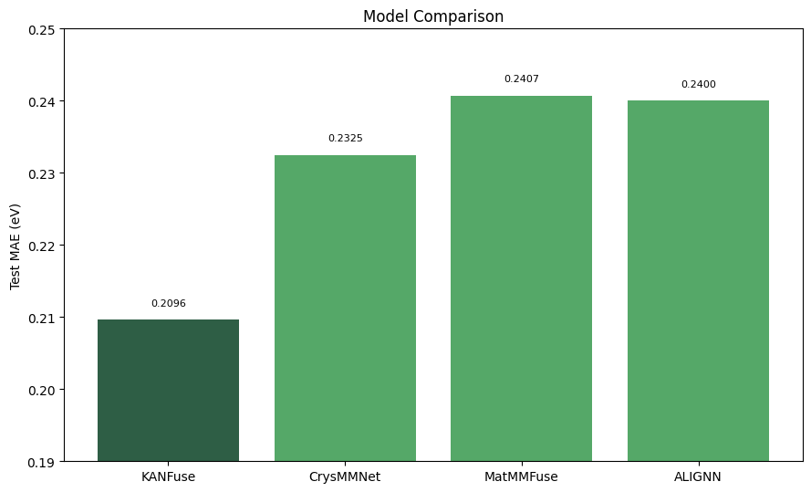

# KAN-Fusion — Multimodal Band-Gap Prediction

Multimodal deep-learning models for predicting the **electronic band gap (eV)** of
crystalline materials from the [Materials Project](https://materialsproject.org/)
(~101k materials). The repository collects four model families side-by-side on a single,
leak-free split so their accuracy and behaviour can be compared directly.

The headline model, **KANFuse**, fuses a crystal-structure graph encoder with a frozen
language-model encoding of a text description of the crystal, and combines them with a
**Kolmogorov–Arnold Network (KAN)** fusion head using learnable B-spline activations.

> **Task:** regress band gap (eV) &nbsp;•&nbsp; **Dataset:** `Godseye1311/alignn-band-gap` (HF), ~101k materials
> &nbsp;•&nbsp; **Split:** seed-0 80/10/10 by `material_id` (signature `b4b968c20eb4`, leak-free — ALIGNN trained
> from scratch on this split, no encoder-pretraining leakage, no train/test overlap).

---

## Results

All models evaluated on the **same** seed-0 leak-free split. **Lead with MAE** — R² is
flattered here by the zero-inflated target (many metals have gap = 0, making the
metal/non-metal split easy).

| Model | Test MAE (eV) ↓ | R² | Notes |
|-------|:---------------:|:--:|-------|
| **KANFuse (OneCycle, best)** | **0.211** | 0.907 | Structure graph + text, KAN fusion. Best model. |
| KANFuse (verifiable ckpt) | 0.2136 | 0.905 | Best *reproducible* weights (ep40); used for all analysis. |
| CrysMMNet | 0.2325 | ~0.89 | Multimodal (graph + text) baseline. |
| MatMMFuse | 0.2407 | — | Multimodal fusion baseline. |
| ALIGNN alone (this repo) | ~0.240 | — | Structure-only encoder baseline. |
| ALIGNN (published, MP E_g) | 0.218 | — | ALIGNN paper, Table 2 (reference). |
| CGCNN / MEGNet / CFID (published) | 0.388 / 0.330 / 0.434 | — | ALIGNN paper, Table 2 (reference). |

**Reading:** KANFuse (0.211) is competitive with the best published structure-only model
(ALIGNN, 0.218) and beats this repo's ALIGNN, CrysMMNet, and MatMMFuse on the same split.
See the caveats below — the margins are thin and single-seed.



---

## Repository layout

Each folder holds the model's **notebook** and its **figures**. Trained weights
(`*.pt` / `*.pth`) are intentionally **not** tracked (they are large and gitignored).

```
KAN-Fusion/
├── KAN-Fusion-Text/   KANFuse — graph + text, KAN fusion  (the hero model)
│   ├── kanfuse.ipynb                 full training + eval pipeline
│   ├── Band_KAN_Fusion.ipynb         standalone KAN-fusion mechanism study
│   ├── kanfuse_training_curve.png
│   ├── spline_pruning.png            spline-ablation sweep
│   └── top10_strongest_splines.png   strongest KAN splines by modality
├── CrysMMNet/         CrysMMNet multimodal baseline
│   └── crysMMNet.ipynb
├── MatMMFuse/         MatMMFuse multimodal baseline
│   └── matMMFuse.ipynb
├── Encoders/          Structure-only encoder (ALIGNN)
│   ├── Band_ALIGNN_Encoder.ipynb
│   └── alignn_mae_plot.png
└── model_comparison.png
```

---

## Architectures

### KANFuse (KAN-Fusion-Text) — the hero model

Two encoder branches → KAN fusion → scalar head. **~6.56M trainable params**
(MatSciBERT ~110M is frozen and excluded).

```
 TEXT (Robocrystallographer description)      GRAPH (crystal structure)
        │                                            │
 MatSciBERT (FROZEN) last_hidden_state       ALIGNN (from scratch), 4 ALIGNN + 4 GCN, hidden 256
 [B, L≤512, 768]                             mean readout → [B, 256]
        │                                            │
 TextTokenFinegrain → [B, 256]               graph_proj: Lin 256→256 + LN + GELU + Drop → [B, 256]
 (Lin 768→256 + LN, 1× TransformerEncoder,          │
  attention-pool via learned query)                 │
        └──────────────┬──────────────────────────────┘
                 concat → [B, 512]
                 pre_kan_norm  LayerNorm(512)
                 KANLinear1  512 → 256   (B-spline activations)
                 KANLinear2  256 → 64    (B-spline activations)
                 head  Linear 64 → 1  →  band gap (eV)
```

- **Text branch** — frozen MatSciBERT (`m3rg-iitd/matscibert`) token sequence →
  `TextTokenFinegrain` (Linear 768→256 + LN; 1× TransformerEncoderLayer, 4 heads, FFN 512,
  `norm_first`; **attention pooling** via a learned query + MultiheadAttention; LN) → 256-d.
- **Graph branch** — `ALIGNNDirect` returning the 256-d readout (not the built-in scalar head);
  `atom_input_features=92, hidden_features=256, 4 ALIGNN + 4 GCN, link=identity`.
- **KAN fusion** — `LayerNorm(512)` → `KANLinear(512→256)` → `KANLinear(256→64)` → `Linear(64→1)`.
  Each `KANLinear` = a SiLU **base path** plus a learnable **B-spline path**
  (`grid_size=5`, `spline_order=3`, `grid_range=(-4,4)`, 12 knots/feature).
- **Training** — L1 loss; AdamW (wd 0.01); bf16 autocast for fusion, fp32 for ALIGNN & MatSciBERT;
  grad-clip 1.0; batch 64. Best model warm-started from a plateau checkpoint and annealed with
  `OneCycleLR(max_lr=3e-4, pct_start=0.3, epochs=40)` (textbook U-curve, bottoming at val 0.2096).

### CrysMMNet
Multimodal graph + text baseline for crystal-property prediction. See `CrysMMNet/crysMMNet.ipynb`.

### MatMMFuse
Multimodal fusion baseline combining structure and text representations.
See `MatMMFuse/matMMFuse.ipynb`.

### Encoders (ALIGNN)
Structure-only reference: the ALIGNN (Atomistic Line Graph Neural Network) crystal-graph
encoder with a scalar regression head, trained directly on band gap. This is the same graph
encoder KANFuse uses internally, evaluated on its own. See `Encoders/Band_ALIGNN_Encoder.ipynb`.

---

## Analysis highlights (KANFuse)

- **Modality is real, not a distributional artifact.** A *shuffle test* (permute text across
  materials, keeping the text distribution but breaking this-crystal pairing) shows a
  reproducible **~0.053 eV** material-specific text contribution. Feeding *wrong* text drops
  KANFuse (0.267) **below** structure-only ALIGNN (0.240) — the gain is genuinely per-material.
- **The KAN splines matter, modestly.** Real-data spline pruning: removing all splines
  (→ SiLU-MLP) costs **+0.042 eV** (~20% of MAE); they are fine calibration, not the core
  mechanism. On average the KAN behaves near-linearly with a small (~5%) genuinely-nonlinear
  tail — see `spline_pruning.png` and `top10_strongest_splines.png`.

---

## Caveats & honesty notes

This is single-seed research code; a few results are **not** fully audited yet:

1. **The exact 0.2107 checkpoint was lost** (overwritten by a racing training run). The best
   *reproducible* weights are **ep40 = 0.2136** — quote that unless a checkpoint is reattached.
2. **Baselines (CrysMMNet, MatMMFuse, ALIGNN) are as-reported** and should be re-run on the
   identical seed-0 split before the comparison is treated as definitive.
3. **Single seed, no error bars.** The margin over published ALIGNN is only ~0.007 eV — inside
   run-to-run variance. Multi-seed runs are needed for a significance claim.
4. **R² ≈ 0.90 is flattered** by the zero-inflated (metal-heavy) target; MAE is the honest metric.
5. **Spline pruning is an ablation, not a retraining** — it does not by itself prove KAN > MLP;
   a from-scratch MLP-fusion baseline is the key outstanding experiment.

---

## Model weights

Weights are **not** in this repo (gitignored). The KANFuse checkpoints live on
Hugging Face (`Godseye1311/kanfuse-band-gap`); other checkpoints are stored separately.
Contact the author to obtain them.

## License

[MIT](LICENSE) © 2026 Shrey Patel
